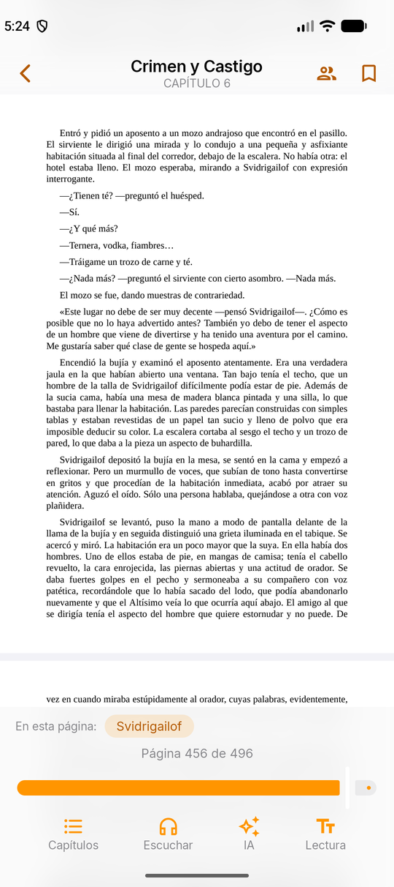
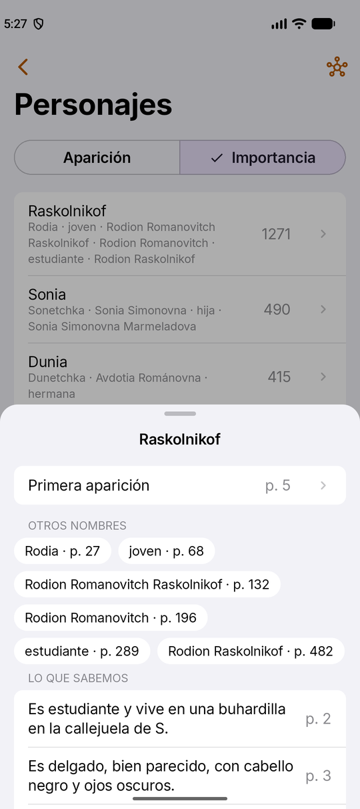
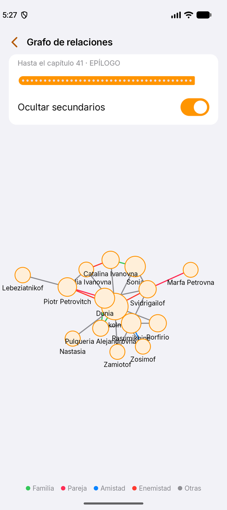
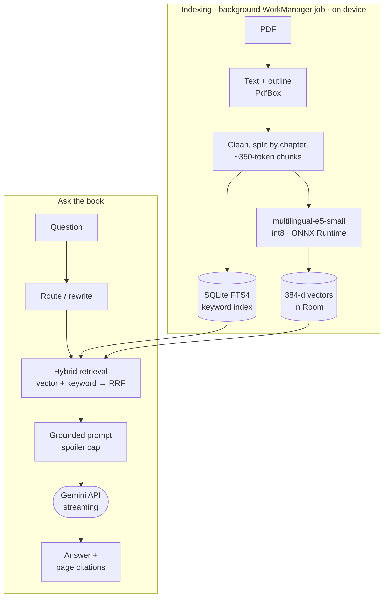

<div align="center">

# AI Reader

**An Android PDF reader that reads books aloud and answers questions about them, with on-device RAG, page citations and no spoilers.**

[](https://github.com/joseramos-dev/ai_reader/actions/workflows/android.yml)


-3DDC84?logo=android&logoColor=white)


<table>
  <tr>
    <td align="center"><br><sub>Reader</sub></td>
    <td align="center"><br><sub>Ask the book (RAG)</sub></td>
    <td align="center"><br><sub>Character profile</sub></td>
    <td align="center"><br><sub>Relationship graph</sub></td>
  </tr>
</table>

<sub>The app's interface is in Spanish. The book in the screenshots is <i>Crime and Punishment</i>.</sub>

</div>

## Overview

AI Reader is a native Android app (Kotlin + Jetpack Compose) for reading and listening to PDF books, with an AI assistant that answers only from the book itself.

There is no backend. PDF processing, text-to-speech, embeddings and semantic search all run on the phone. The only cloud call is text generation, which goes straight to the **Google Gemini API** with the user's own API key (the free tier is enough).

It is a full rewrite of an earlier web prototype (React + FastAPI + a local LLM through Ollama). The new version had two constraints: run well on a budget phone, and cost nothing to host.

## At a glance

| Area | Technologies and techniques |
|---|---|
| **AI / ML** | Retrieval-augmented generation (RAG) · hybrid search (semantic + keyword, Reciprocal Rank Fusion) · sentence embeddings with a Hugging Face model (`multilingual-e5-small`) · ONNX Runtime · int8 quantization · on-device inference · LLM API integration (Google Gemini) · prompt engineering · structured outputs (JSON Schema) · streaming (SSE) · prompt caching · query rewriting · grounded answers with citations · retrieval evaluation (Recall@k, MRR) · LLM cost control |
| **Android** | Kotlin · Jetpack Compose · Material 3 · Hilt · Coroutines & Flow · Room (SQLite FTS4) · WorkManager · Media3 · DataStore · Tink · Navigation Compose |
| **Engineering** | 19-module Gradle build with convention plugins · version catalog · GitHub Actions CI · JUnit, Robolectric and Roborazzi screenshot tests · Macrobenchmark and Baseline Profiles · ktlint · detekt · Android Lint |

## Features

- **Reader.** PDF pages or a reflowable text mode, a chapter index (from the PDF outline, from heuristics, or from the LLM as a last resort), bookmarks, highlights, and it reopens where you left off.
- **Read aloud.** Keeps playing with the screen off, with lock-screen and Bluetooth controls, and highlights the sentence being spoken. Text is cleaned before it is spoken: repeated headers and footers are removed, hyphenated words are joined, and abbreviations and Roman numerals are expanded.
- **Ask the book.** Answers come only from the book's text and cite the pages they use (`[p. 42]`, tap to jump there). When the book doesn't contain the answer, the assistant says so.
- **Summaries and "catch me up".** Per-chapter summaries and a recap of everything up to your current page.
- **Characters (novels).** Names, nicknames and name changes are merged into a single profile. Every fact links to the page it comes from. There is a relationship graph, and the reader shows the characters on the current page.
- **No spoilers.** Characters, relationships, recaps and chat answers only use pages you have already read.
- **Document-aware.** Each PDF is classified as fiction, scientific, educational or general, and the summaries adapt to it (narrative, abstract-style or key concepts).

## How it works



### On-device RAG

1. **Indexing.** Text is extracted with PdfBox, cleaned, split by chapter and cut into ~350-token chunks. Each chunk repeats the last sentence of the previous one, so an idea split across two chunks can still be found. Chunks are stored in Room with an FTS4 index. Each one is also embedded on the device with `multilingual-e5-small` (int8 ONNX export from Hugging Face, 384 dimensions, mean pooling, `query:`/`passage:` prefixes).
2. **Routing.** Questions about the whole book are answered from the chapter summaries, and "summarize this chapter" uses the stored summary. Specific questions go to retrieval. When there is chat history, the question is first rewritten so it makes sense on its own.
3. **Hybrid retrieval.** The top 20 chunks by cosine similarity and the top 20 keyword matches (prefix and accent-insensitive) are fused with **Reciprocal Rank Fusion**. Weak matches are dropped and the best 8 are kept. Keyword search recovers proper nouns, numbers and rare terms that embeddings blur. That matters in a Russian novel, where one character goes by five different names.
4. **Generation.** The prompt starts with a stable prefix (instructions plus book context), which lets Gemini's **implicit prompt caching** apply. The answer streams back over SSE. Any `[p. N]` citation that doesn't match a retrieved chunk is removed as invented, so every page the user sees is one the model was actually shown.
5. **Spoiler cap.** With anti-spoilers on, every chunk, summary and chapter title sent to the model ends at the furthest page you have read.

Vector search is exact. A book's few thousand vectors live in one contiguous `FloatArray`, and a dot-product scan takes milliseconds, so there is no need for an approximate index or a vector database. If the embedding model can't load on a device, retrieval falls back to keyword search instead of failing.

Retrieval quality is measured. A debug-only harness ([tools/rag-eval](tools/rag-eval/README.md)) runs a JSON question set against indexed books. It reports **Recall@1/3/8/20 and MRR** for vector-only, keyword-only and hybrid search.

Code: [AskBook.kt](ai/rag/src/main/java/dev/joseramos/aireader/ai/rag/AskBook.kt) · [HybridRetriever.kt](ai/rag/src/main/java/dev/joseramos/aireader/ai/rag/HybridRetriever.kt) · [Retrieval.kt](ai/rag/src/main/java/dev/joseramos/aireader/ai/rag/Retrieval.kt) · [Chunker.kt](text/src/main/java/dev/joseramos/aireader/text/Chunker.kt) · [RagEvaluation.kt](ai/rag/src/main/java/dev/joseramos/aireader/ai/rag/RagEvaluation.kt)

### Working with the LLM

- **Provider-agnostic.** All generation goes through an [`LlmClient`](ai/llm/src/main/java/dev/joseramos/aireader/ai/llm/LlmClient.kt) interface. [`GeminiLlmClient`](ai/llm/src/main/java/dev/joseramos/aireader/ai/llm/GeminiLlmClient.kt) implements it with OkHttp over the REST API (`generateContent`, plus `streamGenerateContent` with server-sent events). The project started on the Claude API and moved to Gemini for its free tier, and the interface kept that change small.
- **Two model tiers.** Gemini Flash handles the chat, and Flash-Lite handles background work (summaries, character extraction, classification). Both are configurable in Settings.
- **Structured outputs.** Character extraction, document classification and chapter detection use [JSON Schema responses](ai/llm/src/main/java/dev/joseramos/aireader/ai/llm/ResponseSchema.kt), so results are parsed rather than scraped.
- **Cost control.** Each task gets a token estimate. There is a daily token budget with notifications at 80% and 100%, and expensive jobs ask for confirmation first. Transient errors are retried, and quota or invalid-key errors are explained to the user.
- **Key handling.** The API key is encrypted with Tink (AEAD, with the keyset protected by the Android Keystore). It is only sent in the `x-goog-api-key` header, never in URLs or logs.

### Characters without spoilers

- Chapters are analyzed in reading order by [Flash-Lite with a structured schema](ai/characters/src/main/java/dev/joseramos/aireader/ai/characters/CharacterExtractor.kt). The prompt includes a compact list of the characters found so far, so the model reuses their IDs instead of creating duplicates.
- A [merger](ai/characters/src/main/java/dev/joseramos/aireader/ai/characters/CharacterMerger.kt) groups nicknames, spots when a "new" character is a known one, and records name changes from the page where they happen. Each chapter is applied in a single Room transaction, and the background job resumes from the last finished chapter.
- Every fact, nickname and relationship keeps its source page, so the [UI only shows what is unlocked](ai/characters/src/main/java/dev/joseramos/aireader/ai/characters/SpoilerFilter.kt) at your reading position.

### Performance on a budget phone

Indexing a book means embedding several hundred chunks. On a Samsung Galaxy A16 (MediaTek Helio G99: 2 fast + 6 slow cores, 4 GB RAM), the first version used one ONNX Runtime session with 4 threads and batches of 16. Two problems showed up:

- The fast cores waited for the slow ones at every operator.
- About 19% of the work was padding.

The [current embedder](ai/embeddings/src/main/java/dev/joseramos/aireader/ai/embeddings/E5Embedder.kt) runs one single-threaded inference per text, on as many threads as there are cores. The result:

- **2.3× faster** (505 → 216 ms per chunk).
- **About half the peak memory** (~860 → ~420 MB).
- A chat query still embeds in under 50 ms while a book is being indexed.

Other performance work:

- A Baseline Profile generated with Macrobenchmark.
- A scroll benchmark of the reader on a generated 320-page PDF.
- A Compose stability configuration.
- Native support for 16 KB memory pages.

### Privacy and reliability

- PDFs, the text index and the embeddings never leave the device. Each request sends Gemini only the chunks it needs.
- Indexing runs as resumable WorkManager stages. A [crash guard](indexing/src/main/java/dev/joseramos/aireader/indexing/StageCrashGuard.kt) records each stage before it starts. A stage that keeps crashing in native code or running out of memory (failures that can't be caught) is skipped, instead of putting the app into a crash loop.
- Read-aloud runs in a Media3 foreground service, so it keeps going with the screen off and appears on the lock screen and in Bluetooth controls.

## Design decisions

| Decision | Why |
|---|---|
| **No backend** | A server with a GPU good enough for a decent LLM costs around €2,300 a year, and a CPU server can't run one well. Everything except generation runs on the phone, and generation uses the user's own Gemini key. |
| **Hybrid search, not vectors alone** | Embeddings handle paraphrased questions; keyword search handles names, numbers and rare words. RRF combines both rankings without tuning weights. |
| **Exact search, not a vector database** | One book holds a few thousand vectors. A plain scan takes milliseconds and adds no dependency. |
| **Gemini, not Claude** | Gemini has a free tier, so anyone can try the app at no cost. Because generation sits behind `LlmClient`, switching providers touched one module. |
| **System voice, not neural TTS** | I tried Piper, Kokoro (through sherpa-onnx) and Google Cloud TTS. Kokoro sounded best but grew the debug APK from ~204 MB to ~337 MB. Android's built-in voice is light, works offline and is reliable in the background. |
| **Model bundled in the APK, not committed to git** | The model file is larger than GitHub's 100 MB limit. Gradle downloads it at build time from Hugging Face at a pinned revision and checks its SHA-256 before packaging it. Search then works offline from the first launch. |

## Status and limitations

- Work in progress (v0.1.0), not published on Google Play.
- The interface, code comments and commit history are in Spanish. Books can be in other languages, since the embedding model is multilingual.
- Generation needs an internet connection and a Gemini API key. On the free tier, Gemini sometimes answers "high demand" or runs out of daily quota.
- Scanned PDFs without a text layer are not supported yet (no OCR).

## Getting started

You need Android Studio with Android SDK 37, JDK 25 for Gradle (the JBR bundled with Android Studio works, or Gradle provisions it), and a device or emulator running Android 9 (API 28) or later.

```bash
./gradlew installDebug
```

The first build downloads the embedding model (~135 MB) from Hugging Face. To use the AI features, create a free API key in [Google AI Studio](https://aistudio.google.com/apikey) and add it in the app under **Ajustes** (Settings).

Code checks (the same ones CI runs on every push and pull request):

```bash
./gradlew ktlintCheck detekt lintDebug testDebugUnitTest
```

Design-system reference screenshots, rendered on the JVM with Roborazzi:

```bash
./gradlew :core:designsystem:recordRoborazziDebug
```

Reader scroll benchmark (needs a connected device, ideally a real phone):

```bash
./gradlew :benchmark:connectedBenchmarkAndroidTest
```

<details>
<summary><b>Project structure</b></summary>

```
app/                 Application (Hilt + WorkManager), MainActivity and navigation
core/common          Injectable dispatchers and coroutine scopes
core/designsystem    Theme (colors, Inter, spacing) and iOS-style components
core/data            Room, DataStore, encrypted API key (Tink) and repositories
pdf                  Page rendering (PdfRenderer), text and outline extraction (PdfBox)
text                 Text cleaning, sentences, chunks, speech normalization, name matching
tts                  System voice (android.speech.tts), audio pipeline, Media3 playback service
indexing             PDF import and IndexWorker: text, chapters, document type, embeddings
ai/models            Download, verification and installation of on-device models
ai/llm               Gemini client (REST + SSE), prompts, summaries and recaps
ai/embeddings        On-device embeddings (multilingual-e5-small on ONNX Runtime)
ai/rag               Hybrid retrieval, cited answers and retrieval evaluation
ai/characters        Character extraction, nickname merging and spoiler rules
feature/library      Library screen
feature/reader       Reader (PDF and text), voice, bookmarks and AI sheets
feature/chat         Ask-the-book chat
feature/characters   Characters, profile and relationship graph
feature/settings     Settings screen
benchmark/           Macrobenchmark tests and Baseline Profile generator
build-logic/         Gradle convention plugins shared by all modules
tools/rag-eval/      Question-set format for evaluating retrieval
config/detekt/       Static analysis configuration
gradle/              Wrapper and version catalog (libs.versions.toml)
```

</details>

The earlier web prototype (React + FastAPI) is kept under the `prototipo-web` tag and the `legacy/prototipo-web` branch.

---

Built by [@joseramos-dev](https://github.com/joseramos-dev).
